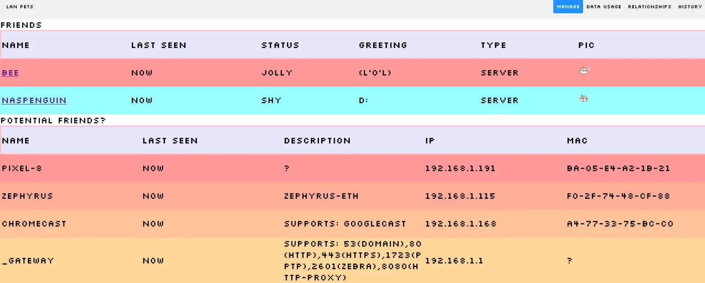
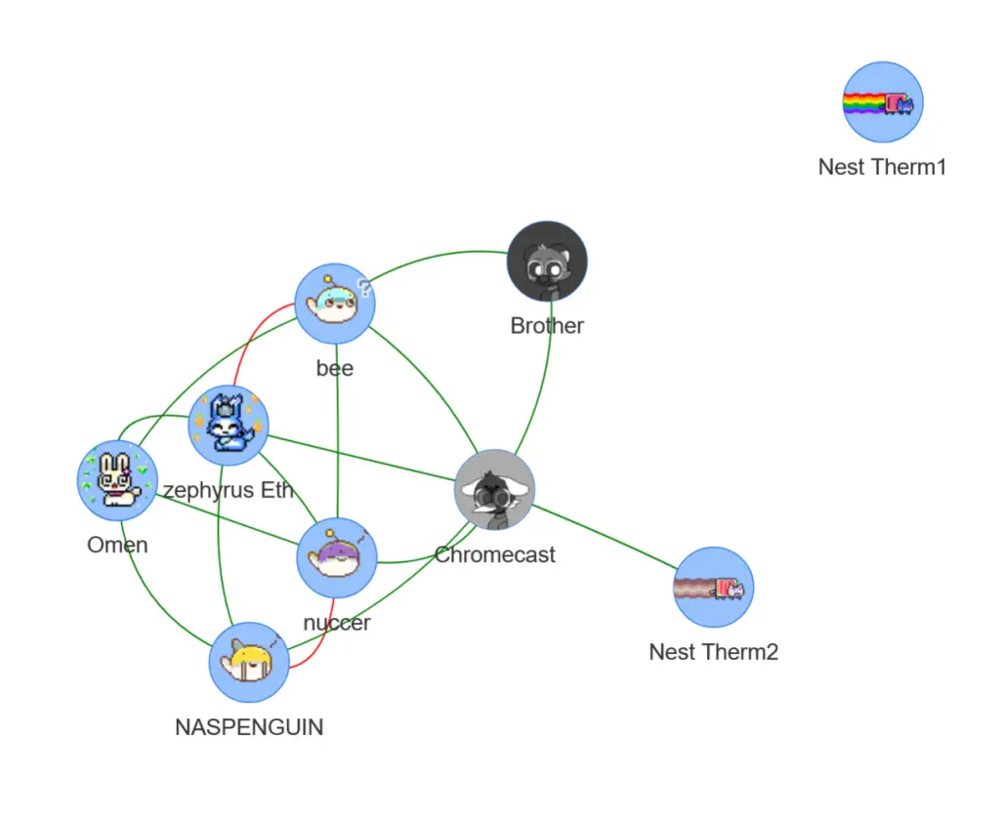
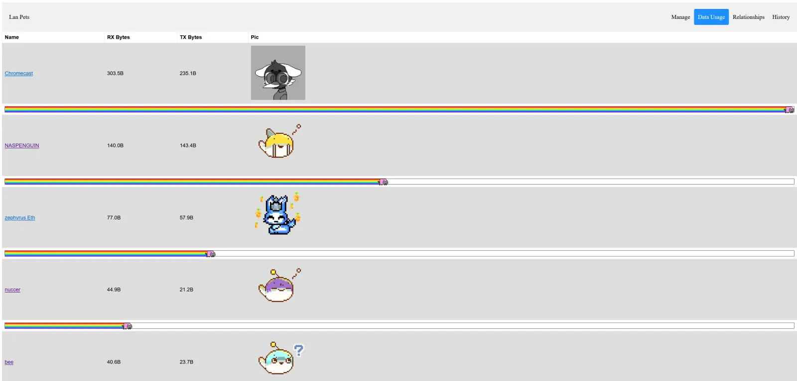

# LAN Pets

Combines the fun of being a sysadmin with the fun of virtual pets!

Shows the status of the local network while also using the information to generate the virtual pets and their interactions.

For a more in depth write up of the design and developement see the blog post:

<https://www.robopenguins.com/lan-pets/>

There are two server applications that make up this project:

1. [pet_monitor/pet_monitor_service.py](pet_monitor/pet_monitor_service.py) - This server gathers information about the computers on the network and saves it to SQLite databases.
2. lan_pets Django app - This runs a web server to act as a GUI for virtual pet interface.

# Usage

Before running modify the [lan_pets/settings.py](lan_pets/settings.py) and [pet_monitor/settings.py](pet_monitor/settings.py) to the desired configuration. You can also use a [pet_monitor/secret_settings.py](pet_monitor/secret_settings.py) to load additional settings ignored by version control.

One the application is up and running, you can interact with it by going to the URL for the webserver (e.x. <http://127.0.0.1:8000/>)

## Setup

To allow the application to periodically ping devices on the LAN without root I found I needed to run:
`echo 'net.ipv4.ping_group_range = 0 2147483647' | sudo tee -a /etc/sysctl.conf && sudo sysctl -p`
to grant access.

## Run in Docker

To run in Docker, you'll need to first have [Docker running on your system](https://docs.docker.com/engine/install/).
After that, run the script [scripts/run_in_docker.sh](scripts/run_in_docker.sh). Read the script for details.

## Run Manually

The first step is to set up a python3 environment either globally, or using a virtual environment. Then you'll need the dependancies in (requirements.txt)[requirements.txt].

After that the LAN monitoring service can be run with:
`python -m pet_monitor.pet_monitor_service`

and the Django webserver can be run with:
`python manage.py runserver`

The NMAP capabilities also require that the [NMAP](https://nmap.org/) tool is installed.

# Pet Monitor Overview

The pet monitor does three things.

1. Find the devices on the LAN
2. Periodically collect data on the known devices
3. Run the "AI" to update the pet moods and relationships

## Settings

There are a lot of settings to adjust based on the details of the data collection, and how the data should be used to generate the pets. These are set in [pet_monitor/settings.py](pet_monitor/settings.py). In addition a file [pet_monitor/secret_settings.py](pet_monitor/secret_settings.py) can be created to load secret settings that shouldn't be checked into version control.

## Network Discovery

Discoverying the devices on the network is one of the more complicated aspects of this project. There isn't any universal method for finding devices on the LAN, and each approach has trade offs.

Some methods for finding devices:
 - Pinging every IP address or checking for TCP sockets or other handshakes
 - Using a UDP broadcast protocol like mDNS
 - Getting results from a central server used to manage the network like the router's DHCP or DNS servers.

### Router GUI Scraping

Since each brand of router is unique, I created a tool that's fairly specific to the router I use (TPLink Omada ER605).

This collects the DHCP reservations, client names, and bandwidth usage.

### NMAP

NMAP is a tool for mapping out networks. It primarily relies on attempting to open ports and other socket hand shakes across a range of IP addresses to determine what's present on the network.

When it comes to discovering the presence of devices on the network, there are a few important behaviors I noticed. First, to get the MAC address of the devices it's scanning, it needs to be on the same LAN segment. Second, it's behavior is different when it is run as a privileged (root) user. Lastly, if NMAP does a port scan on devices it can take an extremely long time, and may have unexpected interactions. For instance I had a Windows machine that would wake from sleep whenever a TCP connection was openened. The `-sn` flag limits NMAP to the discovery stage and skips the port scan.

# LAN Pets WebApp

The web app is used to add pets to be tracked, and to view the results from the monitor.

The `manage_pets` page shows the pets that have been added along with the discovered devices that aren't accociated with a pet.

Adding a pet involves accociating a network identifier with a unique name for the pet. The supported identifiers are:
1. MAC address
2. IP address
3. host name

The pet will be accociated with results that match the giving identifier. Host name can be resolved from DNS, or mDNS.

One aspect of this display is randomly generating an avatar image for the each pet.

# TODO
 - When pihole 6 is released, add integration into pihole API
 - Have option to use NMAP for ping?
 - Handle case where device has mutliple NIC's
 - Add pet conversations
 - Chat bubbles for pet conversations
 - Figure out sensors for each device (ping, http, custom, SNMP)
 - Add more stuff to relationship view, like moods as a color with legend
 - Add different mood algorithms
 - Make relationship logic more involved
 - Have paginated view of activity in reverse chronological order
 - Log Django errors
